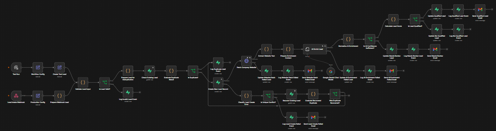
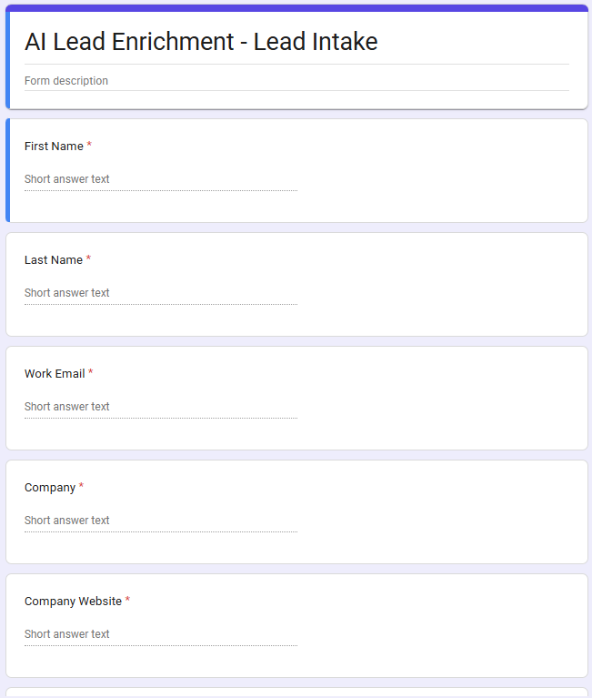
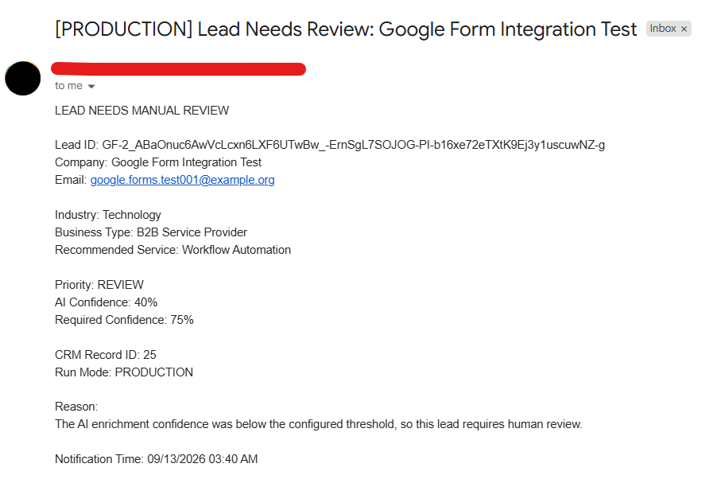
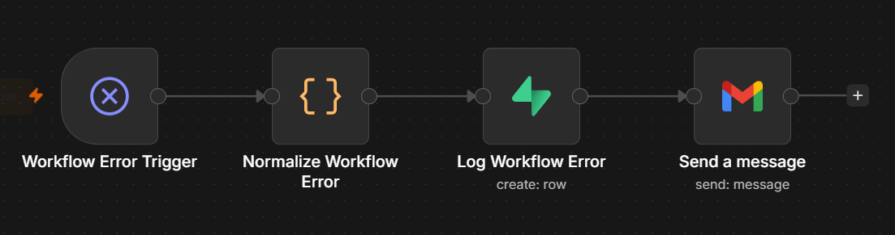

# AI Lead Enrichment & CRM Sync

A production-ready AI lead processing and CRM automation system built with **n8n, Supabase, Google Gemini, Google Forms, Google Apps Script, and Gmail**.

The system accepts leads from a real Google Form, validates and deduplicates them, fetches company website content, enriches lead data with AI, calculates a lead score, updates the CRM, records audit events, and sends operational notifications.

---

## Architecture

```text
Google Form
    ↓
Google Apps Script
    ↓
Authenticated n8n Webhook
    ↓
Input Validation
    ↓
Deduplication
    ↓
Supabase CRM
    ↓
Company Website Fetch
    ↓
Gemini AI Enrichment
    ↓
AI Confidence Gate
    ↓
Lead Scoring
    ↓
Qualification Decision
    ↓
CRM Update
    ↓
Audit Logging
    ↓
Gmail Notifications
```

A separate global error workflow handles unexpected n8n execution failures and logs them to Supabase.

---

## Key Features

- Real lead intake using Google Forms
- Google Apps Script webhook connector
- Header-authenticated production webhook
- Required-field validation
- Email validation
- Website URL validation
- Basic SSRF protection
- TEST and PRODUCTION environment separation
- Multi-key lead deduplication
- Database-level unique constraints
- Duplicate race-condition recovery
- Company website fetching
- Website text extraction
- AI-powered business enrichment using Gemini
- AI confidence threshold
- Rule-based lead scoring
- Qualified / Not Qualified / Needs Review routing
- Supabase CRM updates
- Business event audit logging
- Website fetch failure handling
- AI enrichment failure handling
- CRM creation failure handling
- Global workflow error handling
- Gmail operational notifications

---

## Lead Intake

Production leads are submitted through a Google Form containing:

```text
First Name
Last Name
Work Email
Company
Company Website
Job Title
City
Country
```

Google Apps Script automatically generates the source-side Lead ID and sends the submission to the authenticated n8n webhook.

Example source:

```text
lead_source: GOOGLE_FORM
run_mode: PRODUCTION
```

---

## Lead Validation

Incoming leads are checked before entering the CRM.

Validation includes:

- Required fields
- Email format
- HTTP / HTTPS website protocol
- Embedded URL credential blocking
- Restricted URL ports
- Localhost blocking
- Direct private IPv4 blocking
- Basic private IPv6 blocking

Invalid submissions are logged as audit events rather than being inserted into the CRM.

---

## Lead Deduplication

The workflow uses three independent deduplication keys:

```text
RUN_MODE | LEAD_ID

RUN_MODE | EMAIL

RUN_MODE | COMPANY | WEBSITE
```

Examples:

```text
PRODUCTION|gf-example-id
PRODUCTION|lead@example.com
PRODUCTION|example company|example.com
```

Including the run mode prevents TEST data from conflicting with PRODUCTION data.

PostgreSQL unique indexes provide an additional database-level protection layer against concurrent duplicate submissions.

---

## Duplicate Race-Condition Recovery

The workflow does not rely only on the initial duplicate lookup.

If two identical leads pass the lookup at nearly the same time, the database unique constraint can reject the second insert.

The workflow then:

```text
Create Lead Fails
    ↓
Classify Database Error
    ↓
Unique Conflict?
    ↓
Recover Existing Lead
    ↓
Identify Duplicate Match
    ↓
Log Duplicate Event
```

This protects the CRM from duplicate records caused by concurrent requests.

---

## Website Enrichment

For valid new leads, n8n fetches the submitted company website.

The workflow:

1. Fetches the website
2. Extracts the HTML response
3. Removes script and style content
4. Removes HTML tags
5. Normalizes whitespace
6. Limits the text sent to the AI model

If the website cannot be reached, the lead is moved to manual review and the failure is logged.

---

## AI Enrichment

Google Gemini analyzes the lead and website context.

The enrichment returns:

```text
industry
business_type
recommended_service
ai_confidence
```

Example:

```text
Industry: Technology
Business Type: B2B Service Provider
Recommended Service: Workflow Automation
AI Confidence: 0.90
```

The AI is instructed to avoid inventing unsupported facts.

When evidence is weak, the workflow lowers confidence and routes the lead to manual review.

---

## AI Confidence Gate

The default minimum AI confidence threshold is:

```text
0.75
```

If:

```text
ai_confidence < 0.75
```

the lead becomes:

```text
NEEDS_REVIEW
```

This prevents low-confidence AI classifications from automatically affecting lead qualification.

---

## Lead Scoring

The workflow calculates a score from 0 to 100.

Scoring considers:

```text
Valid lead
Job title
Business type
Industry
Automation opportunity
Website availability
AI confidence
```

The default qualification threshold is:

```text
70 / 100
```

Priority levels:

```text
85 - 100  → HIGH
70 - 84   → MEDIUM
0 - 69    → LOW
```

---

## Business Outcomes

A successfully processed lead may finish as:

```text
QUALIFIED
NOT_QUALIFIED
NEEDS_REVIEW
DUPLICATE
```

Invalid submissions are recorded as:

```text
LEAD_INVALID
```

Operational failure events include:

```text
WEBSITE_FETCH_FAILED
AI_ENRICHMENT_FAILED
LEAD_CREATE_FAILED
WORKFLOW_ERROR
```

---

## Supabase Database

Supabase / PostgreSQL is used as the CRM and audit database.

The project uses three primary tables:

### `leads`

Stores lead and enrichment data such as:

```text
Lead information
Normalized values
Deduplication keys
Industry
Business type
Recommended service
Lead score
Priority
Qualification status
AI confidence
Run mode
```

### `lead_events`

Stores the business audit trail.

Examples:

```text
DUPLICATE_DETECTED
LEAD_QUALIFIED
LEAD_NOT_QUALIFIED
LEAD_NEEDS_REVIEW
LEAD_INVALID
WEBSITE_FETCH_FAILED
AI_ENRICHMENT_FAILED
LEAD_CREATE_FAILED
```

### `workflow_errors`

Stores unexpected workflow-level failures.

Examples of captured information:

```text
Workflow name
Execution ID
Execution mode
Last executed node
Error name
Error message
Execution URL
Occurrence time
```

---

## Error Handling

Expected operational failures are handled inside the main workflow.

### Website Fetch Failure

```text
Website Fetch Error
    ↓
Update CRM to NEEDS_REVIEW
    ↓
Log WEBSITE_FETCH_FAILED
    ↓
Send Gmail Alert
```

### AI Enrichment Failure

```text
AI Error
    ↓
Update CRM to NEEDS_REVIEW
    ↓
Log AI_ENRICHMENT_FAILED
    ↓
Send Gmail Alert
```

### Lead Creation Failure

```text
Database Insert Error
    ↓
Classify Error
    ↓
Attempt Duplicate Recovery
    ↓
Log LEAD_CREATE_FAILED if unrecoverable
    ↓
Send Gmail Alert
```

---

## Global Error Handler

Unexpected n8n execution failures are handled by a separate workflow:

```text
Workflow Error Trigger
    ↓
Normalize Workflow Error
    ↓
Log Workflow Error
    ↓
Send Workflow Error Email
```

This separates expected business failures from unexpected workflow crashes.

---

## Gmail Notifications

Operational Gmail alerts are sent for important events such as:

```text
Qualified Lead
Needs Review
Website Fetch Failed
AI Enrichment Failed
Lead Creation Failed
Unexpected Workflow Error
```

Low-value events such as duplicates and not-qualified leads are logged without unnecessary email notifications.

---

## Google Forms Integration

Google Forms submissions are forwarded to n8n using Google Apps Script.

The Apps Script reads these Script Properties:

```text
N8N_WEBHOOK_URL
N8N_WEBHOOK_SECRET
```

The webhook secret is not hard-coded into the source file.

Production architecture:

```text
Google Form
    ↓
Apps Script onFormSubmit()
    ↓
POST JSON
    ↓
X-Webhook-Secret
    ↓
n8n Production Webhook
```

---

## Security

The project includes several security controls:

- Header-authenticated webhook
- Secrets stored outside source code
- URL protocol validation
- Embedded URL credential blocking
- Localhost blocking
- Direct private IP blocking
- Restricted website ports
- Environment-aware deduplication
- PostgreSQL unique constraints
- Supabase Row Level Security
- Public workflow exports with private credential references removed

Application-level URL validation reduces SSRF risk.

For stronger production security, network-level egress restrictions should also be used where appropriate.

---

## Repository Structure

```text
ai-lead-enrichment-crm-sync
│
├── workflows
│   ├── ai-lead-enrichment-crm-sync-public.json
│   └── ai-lead-enrichment-error-handler-public.json
│
├── apps-script
│   └── google-form-to-n8n.gs
│
├── sql
│   ├── 001_schema.sql
│   └── 002_deduplication_migration.sql
│
├── docs
│   └── setup.md
│
├── screenshots
│   ├── 01-main-workflow.png
│   ├── 02-google-form-intake.png
│   ├── 03-gmail-alert.png
│   └── 04-error-handler-workflow.png
│
├── .gitignore
└── README.md
```

---

## Setup Requirements

You will need:

- n8n
- Supabase
- Google Gemini API access
- Gmail OAuth configured in n8n
- Google Forms
- Google Apps Script

After importing the public n8n workflows, configure your own credentials for:

```text
Supabase
Google Gemini
Gmail
Header Authentication
```

The public workflow exports intentionally exclude private credential references.

---

## Setup Guide

Full installation and configuration instructions are available here:

[View the Setup Guide](docs/setup.md)

---

## Project Screenshots

### Main n8n Workflow

The primary workflow handles intake, validation, deduplication, enrichment, scoring, CRM updates, audit logging, and operational failure paths.



### Google Form Lead Intake

A real Google Form is used as the production lead intake source.



### Production Gmail Alert

Example operational notification generated automatically after a production lead was routed to manual review.



### Global Error Handler

Separate workflow for capturing and reporting unexpected n8n execution failures.



---

## Production Test

The complete integration was tested end-to-end using a real Google Form submission.

Validated production flow:

```text
Google Form
    ↓
Google Apps Script
    ↓
Authenticated n8n Webhook
    ↓
Validation
    ↓
Deduplication
    ↓
Supabase CRM
    ↓
Website Fetch
    ↓
Gemini Enrichment
    ↓
Confidence Decision
    ↓
Lead Decision
    ↓
Audit Log
    ↓
Gmail Notification
```

The production test successfully:

- Created a CRM lead
- Enriched the lead using Gemini
- Applied the AI confidence threshold
- Routed the lead to manual review
- Created a business audit event
- Sent the Gmail notification automatically

---

## Project Status

**Completed and tested end-to-end.**

This project demonstrates:

- AI workflow automation
- API integration
- CRM automation
- Database design
- Deduplication
- AI enrichment
- Lead scoring
- Error handling
- Security controls
- Audit logging
- Production webhook integration

---

## Author

Built as an advanced AI automation and integration portfolio project.